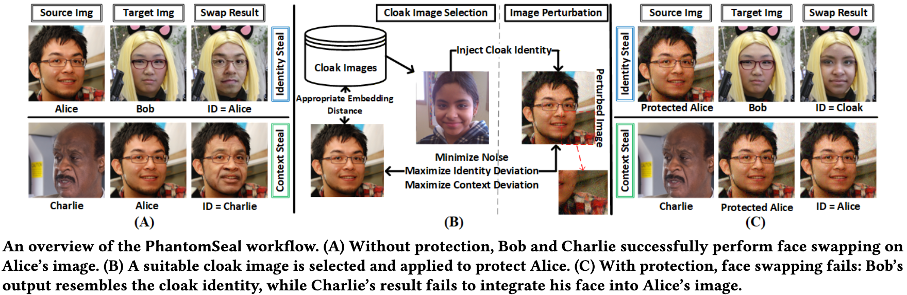

<!-- omit in toc -->
### PhantomSeal: Proactive Deepfakes Defense with Identity/Context Protection and Forensic Tracing

---

**Abstract**: Deepfakes, especially face-swapping attacks, pose significant challenges to authenticity, security, and ethics across science, engineering, and society. While most existing detection/tracing approaches operate post hoc, proactive defenses that aim to intervene before deepfake generation remain limited in terms of real-world effectiveness. In this paper, we present PhantomSeal, the first proactive defense to simultaneously protect both the identity and the context of users' images from being used in face-swapping attacks, while supporting forensic tracing. We present a novel cloaking technique that embeds a selected identity as a stealthy identifier. This mechanism steers the deepfake generation process toward producing content that resembles the chosen cloak identity, thereby preventing successful face-swapping while enabling effective feature-based forensic analysis. The effectiveness and robustness of PhantomSeal is demonstrated in extensive experiments across different face-swapping architectures and models.  For example, it reduces the attack success rate of SimSwap, an advanced deepfake model, to 0.30%, and correctly identifies 97.97% of manipulated content.

<p align="center">
  
</p>

---

<!-- omit in toc -->

### Contents

- [Contents](#contents)
- [Description](#description)
- [Getting Started](#getting-started)
  - [repository](#repository)
  - [dataset and pre-trained models](#dataset-and-pre-trained-models)
  - [PyTorch environment](#pytorch-environment)
- [Usage](#usage)
  - [SimSwap](#simswap)
  - [FaceShifter, HifiFace, Unify, and DiffFace](#faceshifter-hififace-unify-and-diffface)
  - [ArtificialGANFingerprints and SepMark](#artificialganfingerprints-and-sepmark)
  - [FaceSwap](#faceswap)
  - [Note](#note)

### Description

This repository is the official implementation of PhantomSeal, a framework for protecting both image identity and contextual integrity, while enabling forensic traceability. The repository provides the code necessary to reproduce all experimental results, figures, and tables reported in the paper. All random seeds are fixed to 0 to improve experimental stability. Nevertheless, due to inherent nondeterminism in GPU-based computation and iterative optimization, minor variations outputs may still occur.

### Getting Started

We implemented PhantomSeal using Python 3.10.19, PyTorch 2.8, and CUDA 12.8. We execute all experiments on a desktop computer with Ubuntu 24.04 LTS running on AMD Ryzen 9 9950X 16-core CPU, NVIDIA 5090 GPU, and 64 GB memory.

#### repository

Please download the anonymous GitHub repository from the following link:
https://anonymous.4open.science/r/PhantomSeal/

#### dataset and pre-trained models

PhantomSeal evaluates defense performance against five face-swapping models across three datasets. The pre-trained models are provided by the corresponding face-swapping frameworks. To facilitate deployment, we provide scripts that automatically download the required datasets and pre-trained models and place them in the correct directories. The files are hosted on Google Drive, with a total download size of approximately 15 GB. Depending on network conditions, the download process may take up to 15 minutes.

>bash tools/setup.sh

If the automatic download fails, please visit the [Google Drive](https://drive.google.com/drive/folders/1JyQyoEGDsxYamP915gq-aZPpj7jd9BHh?usp=drive_link), download the required files manually, and place them in the corresponding directories.

#### PyTorch environment

We highly recommend readers use Conda and pip to manage the PyTorch environments with the following commands:

>conda env create -f environment.yml  
conda activate phantomseal

### Usage

PhantomSeal offers scripts correspond to the face-swapping models at *scripts* folder to facilitate usage. The readers can run all scripts at the root folder to execute all experiments.

We briefly introduce those functions as follows. For every function, there are detailed parameter explanations in the script.

#### SimSwap

Most experiments are conducted using SimSwap. The supported functions are listed below.

```shell
bash scripts/simswap.sh metric
bash scripts/simswap.sh ai_beauty
bash scripts/simswap.sh protection_robustness_metric
bash scripts/simswap.sh forensics_robustness_metric
bash scripts/simswap.sh image_robustness_metric
bash scripts/simswap.sh adaptive_attack_with_self_image
bash scripts/simswap.sh adaptive_attack_with_other_image
```

For each function, different configurations can be specified to obtain different experimental results. All configuration files are stored in the config directory. For example, the SimSwap configuration file is third_party/simswap.yaml, and the cloak image distance can be set via the command line as third_party.simswap.dataset.cloak_distance=1.04.

```shell
elif [[ $function == 'metric' ]]
then
    run \
    third_party.simswap.dataset.cloak_distance=1.04
```

The results of the test function are reported in Tables 2, 3, 4, 9, 11, 12, 13, 14, 16 and Figure 3.

#### FaceShifter, HifiFace, Unify, and DiffFace

For these models, the only supported function is **metric**. Therefore, experiments can be executed using **either** of the following scripts.

```shell
bash scripts/faceshifter.sh metric
bash scripts/hififace.sh metric
bash scripts/unify.sh metric
bash scripts/diffface.sh metric
```

The results of the test function are reported in Tables 5, 6, 7, 8, and Figure 2.

#### ArtificialGANFingerprints and SepMark

For these models, the only supported function is **metric**. Therefore, experiments can be executed using **either** of the following scripts.

```shell
bash scripts/artificialfingerprint.sh forensics_robustness_metric
bash scripts/sepmark.sh forensics_robustness_metric
```

The results of the test function are reported in Tables 14.

#### FaceSwap

For faceswap, the supported functions are **train**, **test**, and **metric**.

```shell
bash scripts/faceswap.sh train
bash scripts/faceswap.sh test
bash scripts/faceswap.sh metric
```

The results of the test function are reported in Tables 18 and 19, and Figure 4.

#### Note

The default evaluation tool is FaceNet-512. To enable other evaluation tools, such as Face++ and AWS, users need to configure the corresponding API keys in **config/evaluate/evaluate_local.yaml**.

In addition, some functions (e.g., AI_beauty) also require setting up the appropriate API keys. Please refer to the corresponding service providers for API pricing details.
