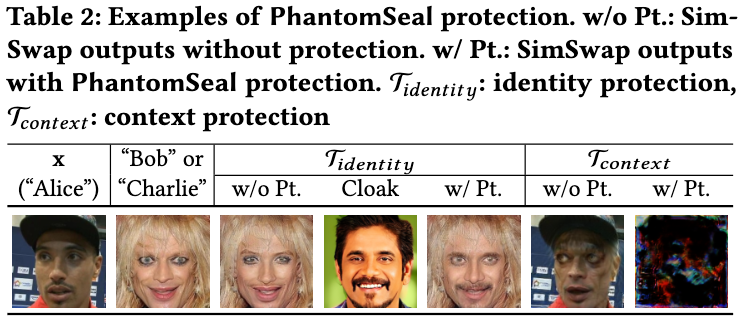
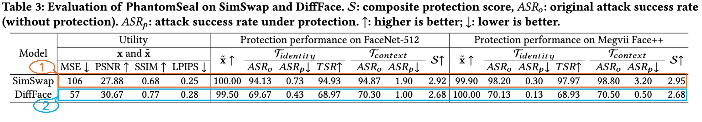
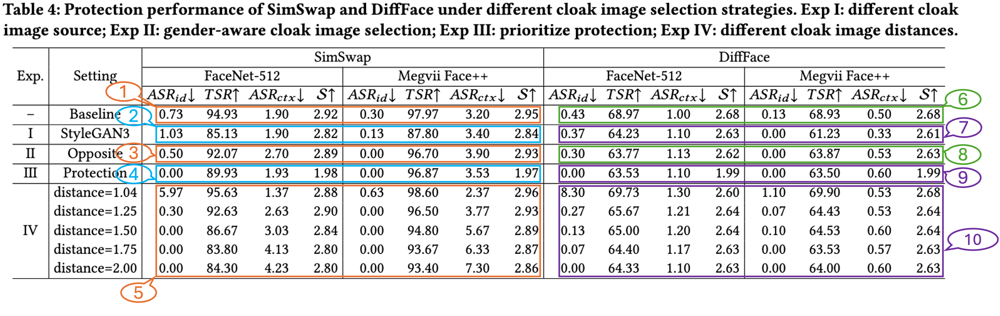
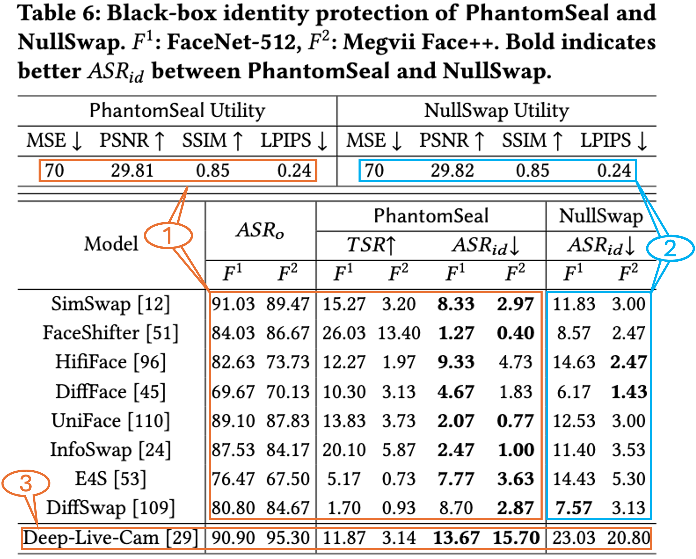
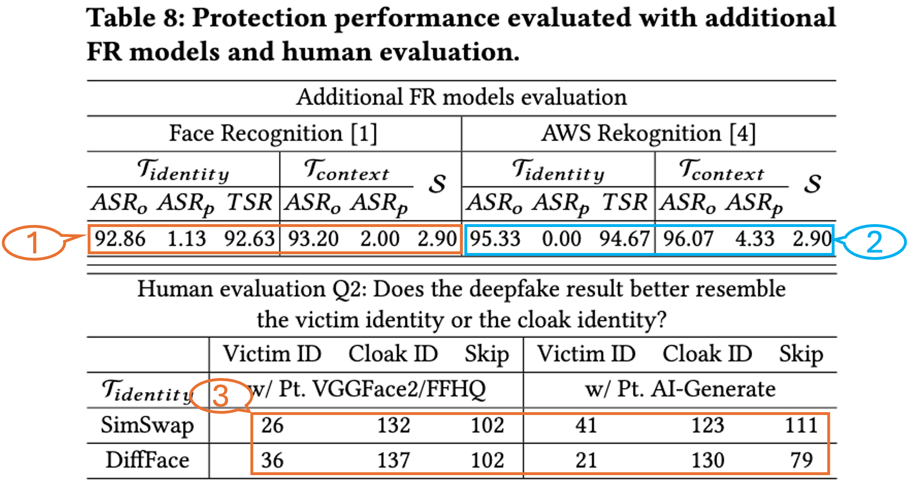
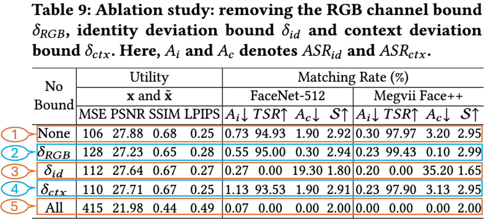
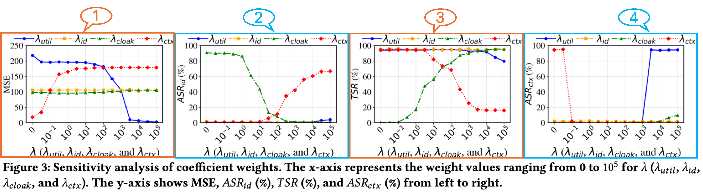
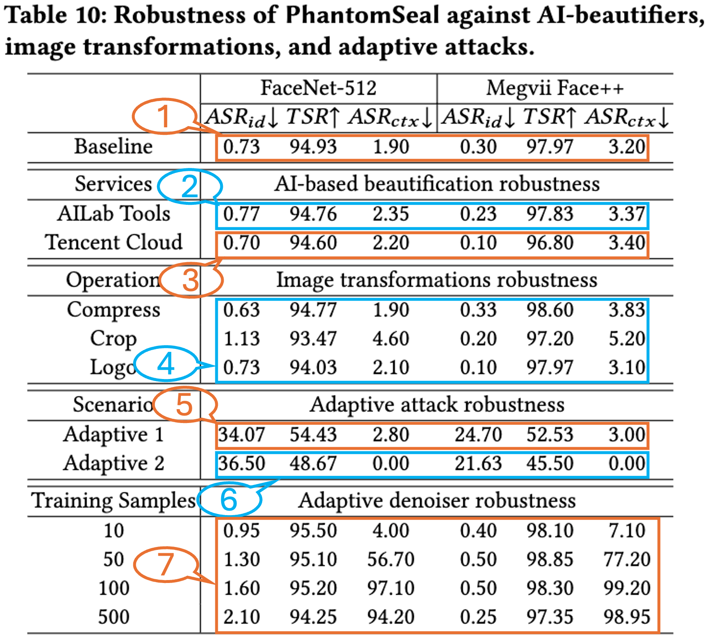
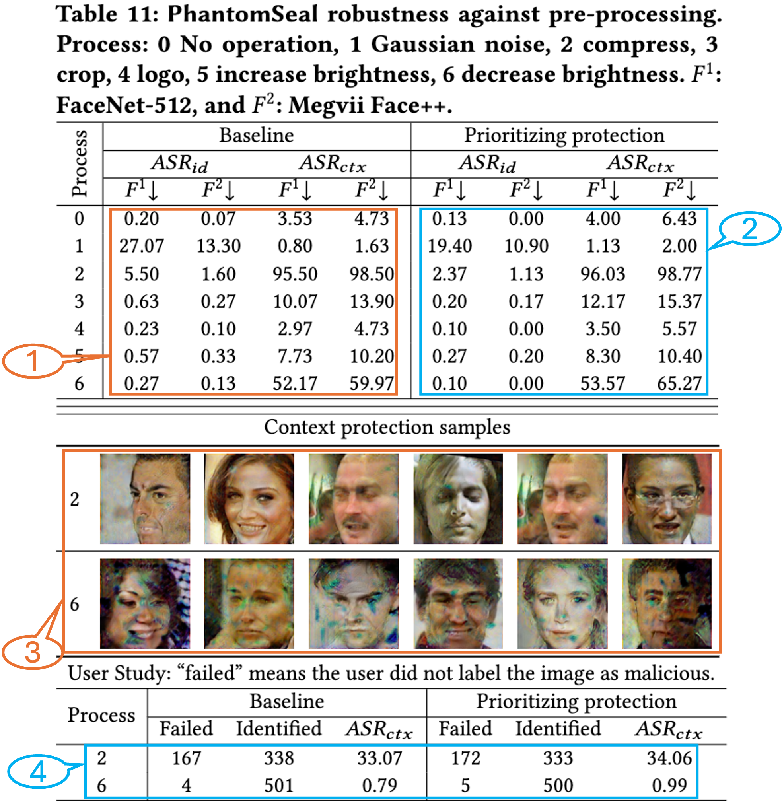

# PhantomSeal: Proactive Deepfakes Defense with Identity/Context Protection and Forensic Tracing

---

**Abstract**: Deepfakes, especially face-swapping attacks, pose significant challenges to authenticity, security, and ethics across science, engineering, and society. While most existing detection/tracing approaches operate post hoc, proactive defenses that aim to intervene before deepfake generation remain limited in terms of real-world effectiveness. In this paper, we present PhantomSeal, the first proactive defense to simultaneously protect both the identity and the context of user images from being used in face-swapping attacks, while supporting forensic tracing. We present a novel cloaking technique that embeds a selected identity as a stealthy identifier. This mechanism steers the deepfake generation process toward producing content that resembles the chosen cloak identity, thereby preventing successful face-swapping while enabling effective feature-based forensic analysis. The effectiveness and robustness of PhantomSeal is demonstrated in extensive experiments across different face-swapping architectures and models. For example, it reduces the attack success rate of SimSwap, an advanced deepfake model, to 0.30%, and correctly identifies 97.97% of manipulated content.


---

## Contents

- [PhantomSeal: Proactive Deepfakes Defense with Identity/Context Protection and Forensic Tracing](#phantomseal-proactive-deepfakes-defense-with-identitycontext-protection-and-forensic-tracing)
  - [Contents](#contents)
  - [Description](#description)
  - [Getting Started](#getting-started)
    - [Environment](#environment)
    - [Dataset, Pre-Trained Models, and Third-Party Projects](#dataset-pre-trained-models-and-third-party-projects)
  - [Usage](#usage)
    - [Table 2](#table-2)
    - [Table 3](#table-3)
    - [Table 4](#table-4)
    - [Table 6](#table-6)
    - [Table 8](#table-8)
    - [Table 9](#table-9)
    - [Figure 3](#figure-3)
    - [Table 10](#table-10)
    - [Table 11](#table-11)

## Description

This repository is the official implementation of PhantomSeal, a framework for protecting both image identity and contextual integrity, while enabling forensic traceability. The repository provides the code necessary to reproduce all experimental results reported in the paper. All random seeds are fixed to 0 to improve experimental stability. Nevertheless, due to inherent nondeterminism in GPU-based computation and iterative optimization, minor variations in outputs may still occur.

We implemented PhantomSeal using Python 3.10.19, PyTorch 2.8, and CUDA 12.8. The experiments reported in the paper were conducted on a workstation running Ubuntu 24.04 LTS with an AMD Ryzen 9 9950X 16-core CPU, an NVIDIA RTX 5090 GPU, and 64 GB memory. The reported results are mainly evaluated with FaceNet-512 and Face++; Face Recognition and AWS Rekognition are also supported as additional evaluation tools. Because Face++ and AWS Rekognition are commercial paid APIs, the open-source code evaluates experiments with the open-source FaceNet-512 and Face Recognition tools by default. To use paid APIs, configure the corresponding key/secret in **config/evaluate/evaluate_local.yaml**.

## Getting Started

### Environment

We strongly recommend using Conda to manage the environment. We provide **environment.yml** to create the default *phantomseal* environment. Please use the following commands to create and activate it.

```shell
conda env create -f environment.yml
conda activate phantomseal
```

A Docker-based environment is under preparation and will be added in a future update.

### Dataset, Pre-Trained Models, and Third-Party Projects

PhantomSeal is a defense framework. The face-swapping models used for evaluation are implemented by their corresponding third-party projects, and this repository integrates them only as evaluation backbones. The datasets, pre-trained models, and third-party project code remain owned by their original authors and are subject to their original licenses and terms.

To facilitate reproduction, we provide setup scripts that initialize the required third-party projects, apply local compatibility patches, and download the datasets and pre-trained model checkpoints from Google Drive. The datasets require about 14 GB of storage, and the checkpoints require about 14 GB. Depending on network conditions, the download process may take up to 20 minutes. Please use the following command to prepare the third-party projects, datasets, and checkpoints.

```shell
bash tools/setup.sh
```

If the automatic download fails, please visit the [Google Drive](https://drive.google.com/drive/folders/1caHioBnA1478FR15W3JzNuHu36zxopJv?usp=sharing), download the required files manually, unzip them, and place them in the repository root folder.

## Usage

All projects are controlled by their corresponding configuration files in *config/third_party*. All running results, including logs, metrics, and saved images, are written to the *logs* folder. Single-run experiments are saved under *logs/run*, while multi-run experiments with multiple parameter settings are saved under *logs/multirun*. In both cases, results are first grouped by date and then by run time. Evaluation runs are processed batch by batch. For each batch, PhantomSeal reports both the current batch result and the cumulative summary up to that batch, so users can monitor the running summary and stop early when enough samples have been evaluated to save time.

Most experiments evaluate 3,000 images by default, and the running time depends on the actual number of images being evaluated. The *reproduce* scripts provide the batch size and total image count used for each experiment, and users can adjust these parameters to obtain faster preliminary results or to control the overall running time. The reported results and expected running times are based on our experimental environment. On different hardware, especially different GPU environments, users may need to adjust the corresponding *batch_size* values in the scripts or configuration files to fit available memory and throughput.

We provide scripts in the *reproduce* folder to reproduce all experimental results reported in the paper. For each figure or table, we divide all reported data into numbered experiments, and the corresponding script runs these numbered experiment blocks in order. Users can comment out unnecessary commands in the script to control which experiments are executed. All commands should be run directly from the repository root directory. Note that although the paper tables use Face++ for evaluation, the open-source artifact uses the open-source Face Recognition evaluation tool instead of Face++ by default. For CCS Artifacts evaluation, please contact us if API access is needed for a small number of paid-API experiments.

### Table 2



The expected running time is 1 minute.

```shell
bash reproduce/table2.sh
```

### Table 3



For experiment 1, the expected runtime is 2.5 minutes per batch and 125 minutes in total. For experiment 2, the expected runtime is 12.5 minutes per batch and 1,250 minutes in total. Note that DiffFace runs much slower than the other experiments because it does not support batched face-swapping.

```shell
bash reproduce/table3.sh
```

### Table 4



For experiments 1-4, the expected runtime is 2.5 minutes per batch and 125 minutes in total. Experiment 5 evaluates five parameter settings, and each setting is expected to take 2.5 minutes per batch and 125 minutes in total.
For experiments 6-9, the expected runtime is 12.5 minutes per batch and 1,250 minutes in total. Experiment 10 evaluates five parameter settings, and each setting is expected to take 12.5 minutes per batch and 1,250 minutes in total.
Experiments 3 and 8 use the Face++ API to infer gender and cannot be run without configuring the corresponding API credentials.

```shell
bash reproduce/table4.sh
```

### Table 6



For experiment 1, the expected runtime is 9 minutes per batch and 2,700 minutes in total. For experiment 2, the expected runtime is 8 minutes per batch and 2,400 minutes in total. Experiment 3 cannot be executed automatically because Deep-Live-Cam requires a subscription and runs as Windows GUI software; therefore, the face-swapping step must be performed manually with the protected images.

```shell
bash reproduce/table6.sh
```

### Table 8



For experiments 1 and 2, the expected runtime is 2.5 minutes per batch and 125 minutes in total. Experiment 2 cannot be run without configuring the corresponding AWS API credentials. Experiment 3 reports the user study result and therefore does not have a corresponding program to execute.

```shell
bash reproduce/table8.sh
```

### Table 9



For experiments 1-5, the expected runtime is 2.5 minutes per batch and 125 minutes in total.

```shell
bash reproduce/table9.sh
```

### Figure 3



For experiments 1-4, the expected runtime is 2.5 minutes per batch and 125 minutes per parameter setting. Each experiment is a SimSwap multirun over 15 parameter settings and is expected to take 1,875 minutes in total. Each subplot in Figure 3 corresponds to one Y-axis metric, such as MSE or $ASR_{id}$. Therefore, after all parameter settings finish running, the results for the same Y-axis metric are collected across different parameter values and reorganized to produce each subplot.

```shell
bash reproduce/figure3.sh
```

### Table 10



For experiments 1-3, the expected runtime is 2.5 minutes per batch and 125 minutes in total. Experiments 2 and 3 require paid API credentials for the corresponding AI beauty services and cannot be run without configuring those credentials. For experiment 4, the expected runtime is 6 minutes per batch and 300 minutes in total. For experiments 5 and 6, the expected runtime is 4 minutes per batch and 200 minutes in total. Experiment 7 evaluates four denoiser checkpoints, and each checkpoint is expected to take 1 minute per batch and 60 minutes in total, with 240 minutes expected for the full multirun.

```shell
bash reproduce/table10.sh
```

### Table 11



For experiments 1 and 2, the expected runtime is 3.5 minutes per batch and 175 minutes in total. Experiment 3 shows image samples saved in the corresponding log directory under the *images* folder. Experiment 4 reports the user study result and therefore does not have a corresponding program to execute.

```shell
bash reproduce/table11.sh
```
